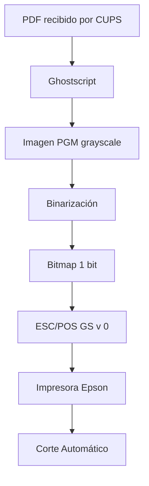
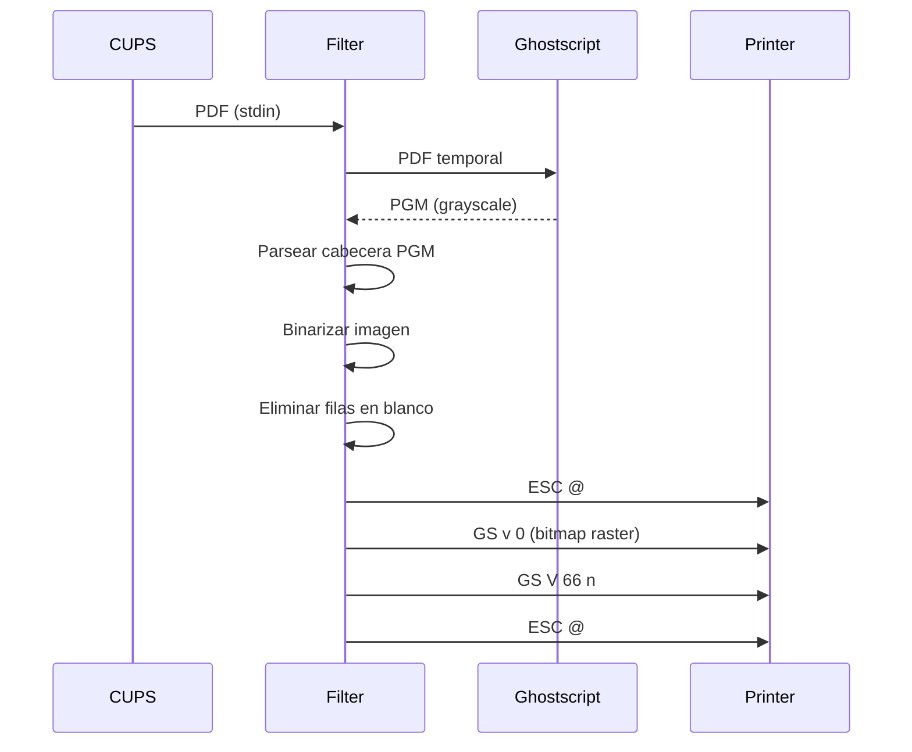
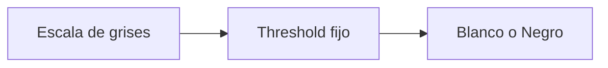
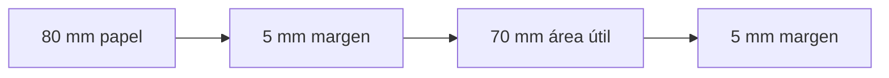
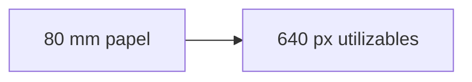

# Documentación Técnica - rastertoescpos

## Introducción

rastertoescpos es un filtro CUPS diseñado para impresoras térmicas ESC/POS, específicamente probado para la Epson TM-T20III.

Su objetivo es convertir documentos PDF recibidos por CUPS en comandos ESC/POS nativos que puedan ser enviados directamente a la impresora a través de un backend RAW (socket://, usb://, etc.).

El filtro realiza:

- Lectura del PDF desde stdin.
- Rasterización mediante Ghostscript.
- Conversión a escala de grises.
- Binarización (blanco y negro).
- Generación de comandos ESC/POS Raster.
- Alimentación previa al corte.
- Corte automático del ticket.

## Arquitectura General



## Flujo Completo del Proceso



## Parámetros Principales

### WIDTH_PX

```
WIDTH_PX = 640
```


Define el ancho final del bitmap enviado a la impresora.

Para una TM-T20III:

```
203 dpi
80 mm
≈ 640 puntos
```

#### Impacto

Mayor valor:

- Más ancho útil
- Menor margen lateral
- Riesgo de recorte en algunos modelos

Menor valor:

- Más margen lateral
- Mejor compatibilidad
- Menor aprovechamiento del papel


### CUT_FEED_DOTS

```
CUT_FEED_DOTS = 80
```


Cantidad de puntos alimentados antes del corte.

Conversión:

```
203 dpi
≈ 8 puntos/mm
```


Por tanto:

```
80 puntos ≈ 10 mm
```

### BAND_HEIGHT

```
BAND_HEIGHT = 1000
```


Actualmente no tiene efecto práctico porque la impresión completa se transmite en un único bloque raster.

Originalmente estaba pensado para dividir tickets largos.

### DARKNESS_THRESHOLD

```
DARKNESS_THRESHOLD = 160
```


Parámetro más importante para la calidad visual.

### Binarización

#### Funcionamiento

La imagen llega como escala de grises:

```
0      = negro
255    = blanco
```


Luego:

```python
if g < threshold:
	imprimir punto negro
```

#### Ejemplo

Threshold:

```
160
```


Imagen:

```
40
80
120
160
200
```


Resultado:

```
NEGRO
NEGRO
NEGRO
BLANCO
BLANCO
```

## Problemas Detectados

### 1. Pérdida de Grises

#### Síntoma

Imágenes PNG:

- pierden degradados
- pierden sombras
- pierden texturas

#### Causa

Binarización por umbral simple.




No existen tonos intermedios.

### 2. Líneas Punteadas Continuas

#### Síntoma

Líneas:

```
---- ---- ----
```


aparecen como:

```
--------------
```

#### Causa

El antialiasing genera grises intermedios.

Al aplicar un threshold alto:

```
gris oscuro -> negro
```


los espacios terminan cerrándose.

### 3. Diferencias Respecto al Driver Epson

#### Síntomas

- Fuentes más grandes
- Márgenes laterales distintos
- Posible recorte derecho

## Comparación Teórica

### Driver Epson



### Filtro Actual




El filtro intenta utilizar prácticamente todo el ancho disponible.

## Conversión Píxeles ↔ Milímetros

Para 203 DPI:

```
203 / 25.4 = 7.99 px/mm
```


Aproximación:

```
1 mm ≈ 8 px
```

| Milímetros | Píxeles |
| --- | --- |
|  1 mm | 8 px |
|  4 mm | 32 px |
|  5 mm | 40 px |
| 10 mm | 80 px |

## Ajustes Recomendados

### Perfil Oscuro

```
DARKNESS_THRESHOLD = 180
```


Ventajas:

- Logos sólidos
- Texto grueso

Desventajas:

- Menos detalles
- Más empastado

### Perfil Equilibrado

```
DARKNESS_THRESHOLD = 145
```


Ventajas:

- Mejor detalle
- Mantiene buen negro

Recomendación general.

### Perfil Claro

```
DARKNESS_THRESHOLD = 120
```


Ventajas:

- Preserva líneas finas
- Recupera detalles

Desventajas:

- Logos menos intensos

